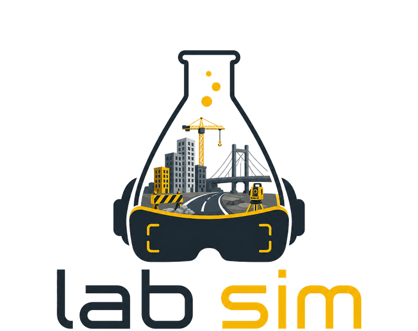

<p align="center">
  
</p>

# LabSim

I go to a Tier-2 college where the civil and mechanical labs are... let's just say
"functional." Half the equipment is old, slots fill up fast before exams, and if
you miss your turn you're basically copying someone else's readings. So I built
LabSim — a browser-based lab where you can actually run the experiment yourself,
get a real (simulated) result based on real formulas, and even get grilled on it
by an AI afterward like an actual viva.

**Live:** `https://lab-sim-omega.vercel.app/#/`
**Me:** [Harsh Patel](https://github.com/harxhpatell) — B.Tech Civil Engineering, NIT Agartala

---

## What's actually in it

9 experiments across civil and mechanical engineering right now. Every one of them
uses the real formula from the actual code — I'm not faking a curve, the math runs
live off whatever numbers you type in.

**Civil:**

| Experiment | Code | What it does |
|---|---|---|
| Slump Test | IS 1199 | Type in a w/c ratio, watch a canvas-drawn cone slump, plotted live against the IS curve |
| Beam Deflection | IS 456 | Set span/load/I, watch a simply-supported beam actually bend, checked against L/360 |
| Sieve Analysis | IS 2386 | Enter retained weights, get the gradation curve + fineness modulus |
| CBR Test | IS 2720-16 | Enter load-penetration readings, read CBR% at 2.5mm and 5mm off the curve |
| Cube Crushing | IS 516 | Enter failure loads for 3 cubes, check mean strength against target grade |
| Compaction Test | IS 2720-7 | Enter moisture/wet-mass readings, get the Proctor curve with OMC and MDD marked |

**Mechanical (new):**

| Experiment | Code | What it does |
|---|---|---|
| Tension Test | IS 1608 | Enter load at each extension, get the full stress-strain curve — E, yield, UTS, % elongation |
| Torsion Test | IS 1717 | Enter torque at each twist angle, get the shear modulus off the torque-twist slope |
| Impact Test (Izod) | IS 1598 | Enter the pendulum's rise angle after breaking a specimen, get energy absorbed + toughness |

On top of that:

- 🤖 **AI Viva Coach** — after you finish an experiment, it asks you 3 questions based
  on *your* actual result, not a generic question bank. Grades your answer, gives a
  hint if you're stuck, tracks your score.
- 📄 **PDF Lab Manual** — one click and you get an actual formatted lab report:
  aim, procedure, your inputs, your results, the observation table, your viva score.
- 👤 **Accounts** — sign in (totally optional) and every attempt gets saved to a
  dashboard so you can see your history. Skip it and everything still works fine.

---

## Why I built it this way

**React + Vite** for the frontend, **D3** for every single graph (no chart library
doing the thinking for me — I wanted the curves to actually be driven by the math).
**Gemini** powers the viva coach, running through a small serverless function on
Vercel so the API key never touches the browser. **Supabase** handles accounts —
Postgres + Row Level Security, so even I can't see other people's saved attempts
without going through the same auth everyone else does.

I went with Vercel over plain GitHub Pages because the viva coach genuinely needs a
backend (however small) to keep the API key safe — static hosting alone can't do that.

---

## Project layout

```
labsim-app/
├── api/
│   └── viva.js                the only place the Gemini key lives
├── src/
│   ├── App.jsx                 all the routes
│   ├── index.css                design system — hazard yellow/black, mobile-first
│   ├── components/
│   │   ├── NavBar.jsx            Civil/Mechanical dropdowns + hamburger on mobile
│   │   ├── ExperimentLayout.jsx  the shell every experiment plugs into
│   │   └── VivaCoach.jsx         the viva chat UI
│   ├── context/AuthContext.jsx
│   ├── lib/supabaseClient.js
│   ├── pages/ (Home, Login, Dashboard)
│   ├── experiments/ (all 9, one file each)
│   └── utils/
│       ├── generateLabManual.js  PDF builder
│       └── saveAttempt.js        writes to Supabase if you're logged in
├── supabase/schema.sql          run this once in Supabase's SQL editor
└── vercel.json
```

---

## Formulas, so you can check my work

- **Slump:** `slump = (w/c − 0.40) × 200`, clamped 0–80mm
- **Beam deflection:** `δ = WL³/(48EI)`, checked against L/360, E = 25,000 N/mm² (M25 assumed)
- **Sieve:** fineness modulus = Σ(cumulative % retained on the 6 standard sieves) ÷ 100
- **CBR:** `CBR% = (test load / standard load) × 100` at 2.5mm (13.24kN) and 5mm (19.93kN), higher governs
- **Cube crushing:** `strength = load / (150×150)`, averaged over 3 cubes vs fck
- **Compaction:** `dry density = bulk density / (1 + moisture fraction)`, OMC/MDD from the peak of the curve
- **Tension:** stress = load/area, strain = extension/gauge length, E from the elastic-region slope
- **Torsion:** `G = T·L / (J·θ)`, averaged across readings
- **Impact:** `E = W·R·(cos β − cos α)`

A few of these are simplified on purpose (I say so in the app where it matters) —
this is a teaching tool, not a certified testing machine. The point is understanding
the shape of the relationship, not decimal-perfect lab-grade precision.

---

## Running it yourself

```bash
git clone https://github.com/harxhpatell/LabSim.git
cd LabSim/labsim-app
npm install
```

Copy `.env.example` to `.env.local`, fill in three things:

```
GEMINI_API_KEY=...        # aistudio.google.com/apikey — free tier, no card needed
VITE_SUPABASE_URL=...     # supabase.com — new project, then Settings > API
VITE_SUPABASE_ANON_KEY=...
```

Then, so the viva coach actually works locally (plain `npm run dev` won't serve the
`/api` function):

```bash
npm install -g vercel
vercel dev
```

For Supabase, also run `supabase/schema.sql` once in your project's SQL editor —
that sets up the `attempts` table with Row Level Security.

To deploy: import the repo on Vercel, add the same three env vars in
Settings → Environment Variables (tick Production/Preview/Development for each),
deploy. Every push to `main` redeploys automatically after that.

---

## Where this is headed

Started as just a slump test simulator for a single assignment. Turned into this.
Next up, probably: a couple more experiments (open to suggestions honestly), maybe
a compressive/hardness test for mechanical, and eventually a proper demo video once
I stop finding small things to fix.

If you're at a college with the same lab-access problem and this is useful to you —
that's really why I built it.
